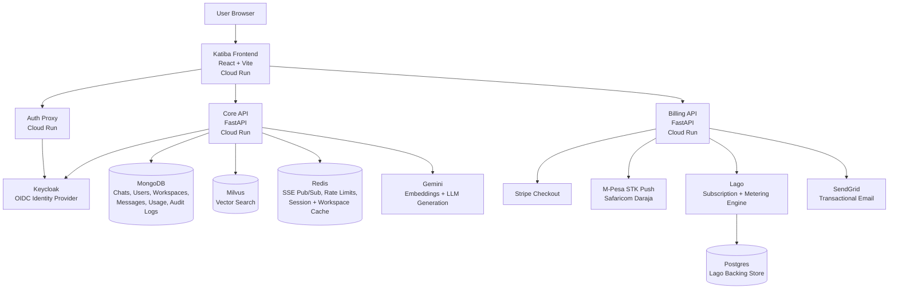
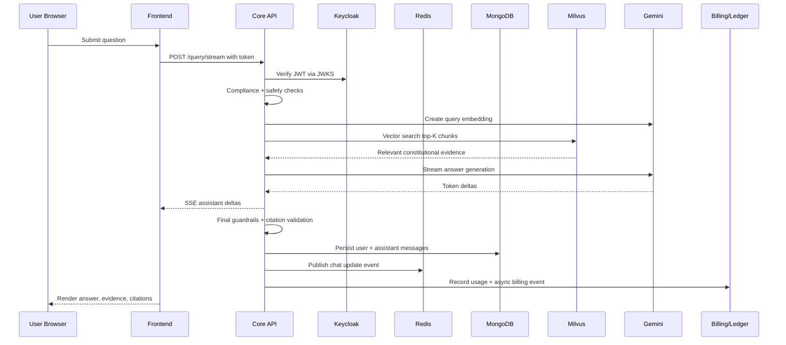
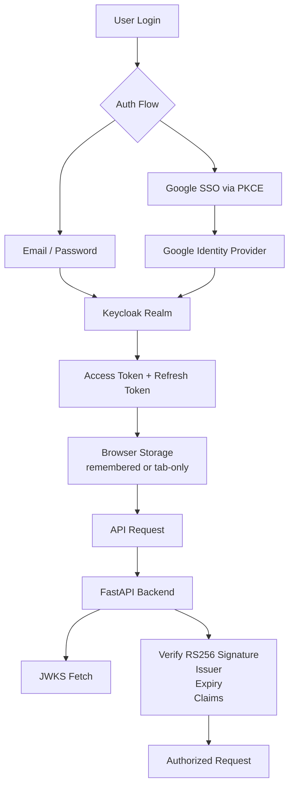
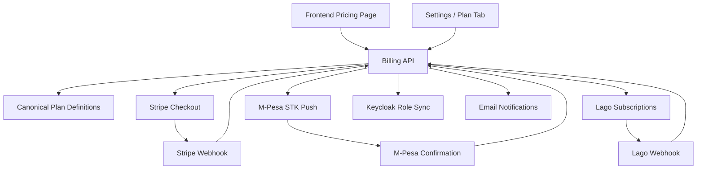
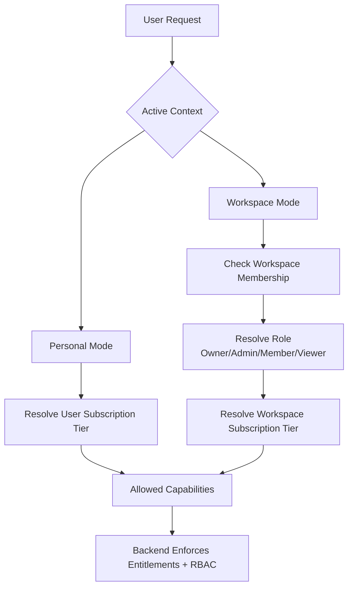
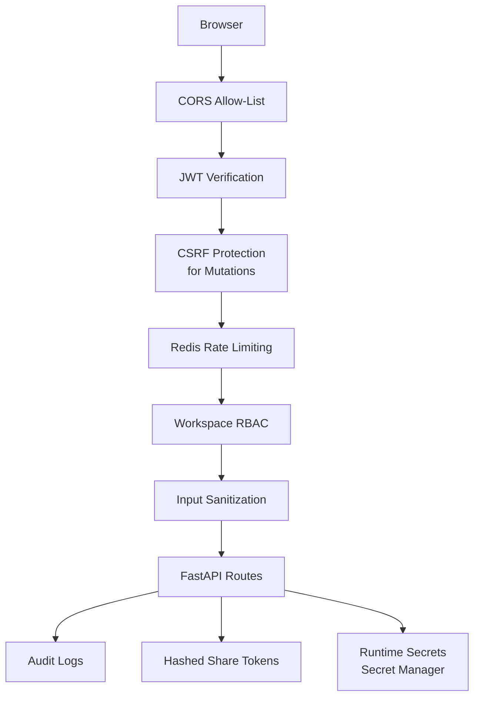
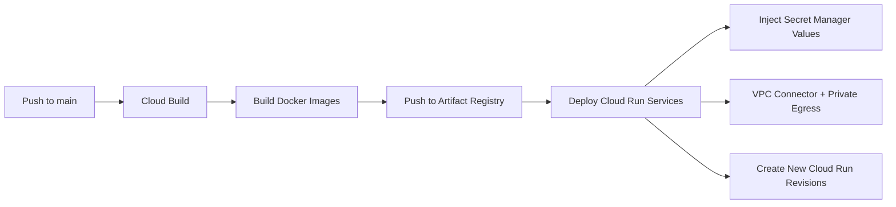
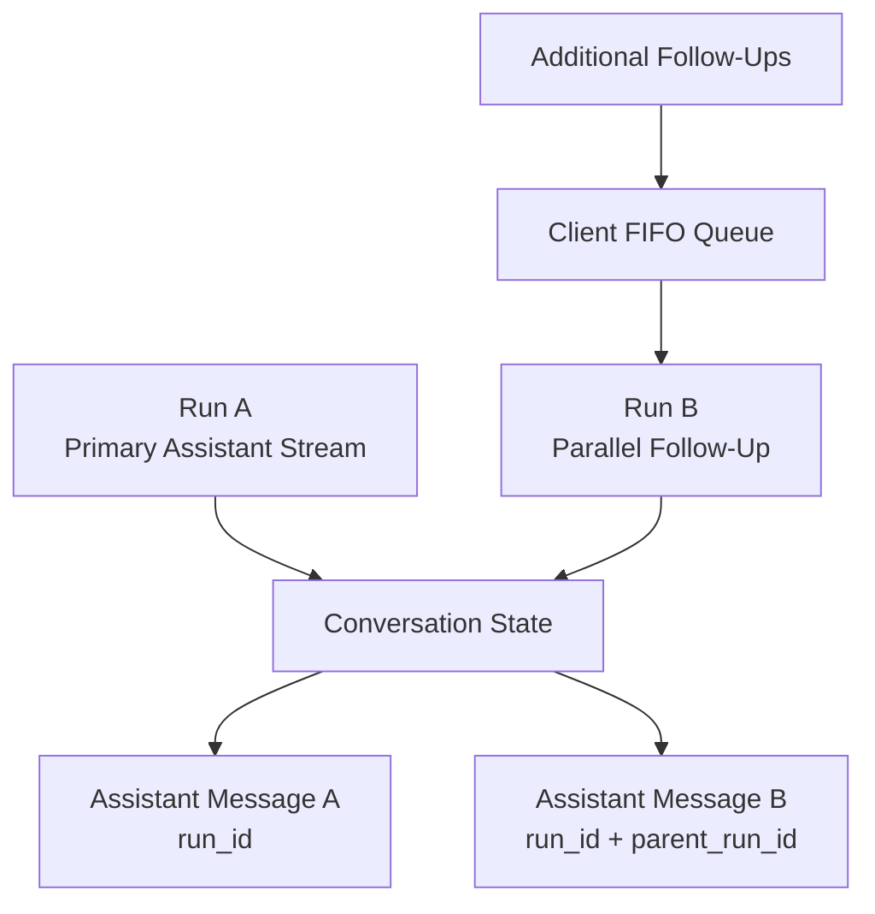

# Katiba AI — AI-Powered Kenyan Constitution Assistant

> **Production-grade RAG platform for constitutional and civic intelligence in Kenya.**  
> Built end-to-end across AI architecture, backend services, frontend experience, cloud infrastructure, authentication, billing, observability, and security.

[Live Website](https://katiba.ai/) · `AI Engineering` · `RAG` · `Cloud Run` · `FastAPI` · `React` · `Vector Search` · `Keycloak` · `Stripe` · `M-Pesa` · `Lago`

---

## Overview

**Katiba AI** is an AI-powered platform that helps users ask questions about the Constitution of Kenya and receive grounded, citation-aware answers. The system combines retrieval-augmented generation, constitutional document indexing, streaming chat, workspace collaboration, subscription billing, and production cloud infrastructure.

I worked on Katiba AI end-to-end, from the AI pipeline and backend architecture to the frontend product experience, authentication, billing, deployment, security controls, and operational readiness.

The project is designed as more than a chatbot. It is a multi-service civic intelligence platform with:

- Constitutional Q&A grounded in retrieved source material
- Live streamed AI responses using server-sent events
- Article-level citation support
- Chat history, branching, sharing, notes, feedback, and read-aloud features
- Workspace collaboration for teams
- Tier-based entitlements and billing
- Stripe card checkout and M-Pesa STK Push support
- Keycloak-based identity and Google SSO
- Usage metering, audit logs, and operational observability
- Production deployment on Google Cloud Platform

---

## My Role

I owned the system as a fullstack, AI, and cloud engineer.

### Areas I designed and implemented

| Area | Ownership |
|---|---|
| AI / RAG | Constitution chunking, embeddings, vector retrieval, evidence rendering, hallucination checks, Gemini integration, streamed generation |
| Backend | FastAPI services, chat APIs, SSE streaming, auth middleware, usage ledger, workspace APIs, billing integrations |
| Frontend | React/Vite app, streamed chat UX, route-state persistence, workspace flows, pricing/settings UI, analytics views |
| Cloud | Cloud Run services, stateful service deployment, VPC connectivity, Secret Manager, Artifact Registry, Cloud Build |
| Authentication | Keycloak OIDC, Google SSO, JWT verification, token refresh, remember-device behavior, SSE auth handling |
| Billing | Stripe Checkout, M-Pesa STK Push, Lago subscriptions, webhook handling, plan definitions, usage events |
| Security | CSRF protection, rate limiting, RBAC, hashed share tokens, audit logs, CORS allow-listing, secret isolation |
| Operations | Health checks, structured logging, rollback strategy, incident debugging, CI/CD pipeline design |

---

## Why This Project Matters

Katiba AI targets a real civic access problem: legal and constitutional information can be difficult to navigate, especially for non-specialists. The system gives users a conversational way to explore constitutional topics while grounding answers in retrieved constitutional evidence.

The goal was to make constitutional knowledge more accessible without reducing reliability. This required building a system that balances:

- Fast conversational UX
- Trustworthy retrieval and citation grounding
- Safety and compliance guardrails
- Multi-tenant workspace support
- Monetization and entitlement enforcement
- Production reliability and cost awareness

---

## High-Level Architecture

Katiba AI is deployed as a multi-service system on Google Cloud.

At a high level, the platform consists of:

1. A public frontend application
2. A core AI/chat API
3. A dedicated billing API
4. An authentication proxy for Keycloak
5. A stateful backend layer for databases, vector search, cache, identity, and metering services

### Figure 1 — Production Architecture



---

## Production Service Topology

The production system is organized into separate deployable services to reduce blast radius and make each domain independently maintainable.

| Service | Responsibility | Platform |
|---|---|---|
| `katiba-frontend` | Public web application, chat UI, pricing, settings, workspace UI | Google Cloud Run |
| `katiba-api` | Core AI API, RAG pipeline, chat, workspaces, usage ledger, auth verification | Google Cloud Run |
| `katiba-billing` | Plans, checkout, billing webhooks, Lago synchronization, M-Pesa flow | Google Cloud Run |
| `katiba-keycloak-proxy` | Public auth proxy in front of Keycloak | Google Cloud Run |
| Stateful stack | MongoDB, Milvus, Redis, Keycloak, Lago, Postgres | Google Compute Engine |

The system currently keeps stateful services together for cost efficiency, deployment simplicity, and operational control during the current scale band. The architecture is intentionally designed so those components can later be moved to managed services such as managed Redis, managed MongoDB, or a managed vector database when traffic justifies the cost.

---

## Technology Stack

### Frontend

| Category | Technology |
|---|---|
| Framework | React |
| Build Tool | Vite |
| Language | TypeScript |
| Styling | Design-token driven UI system |
| Markdown | `react-markdown`, `remark-gfm` |
| Charts | Recharts |
| Streaming | Server-Sent Events |
| Voice Input | Browser Web Speech API |
| State Preservation | Custom hooks for route state, scroll restoration, return redirects, workspace sync |

### Backend

| Category | Technology |
|---|---|
| API Framework | FastAPI |
| Language | Python |
| Streaming Client | `httpx.AsyncClient.stream()` |
| Data Validation | Pydantic |
| Logging | Structured JSON logging |
| Auth Verification | JWT RS256 + JWKS |
| Cache / PubSub | Redis |
| Main Database | MongoDB |
| Vector Database | Milvus |

### AI / RAG

| Category | Technology |
|---|---|
| Embeddings | Gemini text embedding model |
| Embedding Dimension | 768 dimensions |
| Similarity | Cosine similarity |
| Generation | Gemini 2.5 Flash / Gemini 2.5 Pro |
| Retrieval | Milvus top-K vector search |
| Grounding | Constitution hierarchy metadata |
| Guardrails | Input compliance, evidence checks, output validation |

### Cloud / DevOps

| Category | Technology |
|---|---|
| Cloud Provider | Google Cloud Platform |
| Compute | Cloud Run + Compute Engine |
| CI/CD | Cloud Build |
| Images | Artifact Registry |
| Secrets | Google Secret Manager |
| Networking | VPC connector, private egress for internal services |
| Logs | Cloud Logging |
| Rollback | Cloud Run revision traffic splitting |

### Billing / Identity

| Category | Technology |
|---|---|
| Identity Provider | Keycloak |
| SSO | Google SSO via OIDC / PKCE |
| Card Payments | Stripe Checkout |
| Mobile Money | Safaricom Daraja M-Pesa STK Push |
| Subscription Metering | Lago |
| Email | SendGrid |

---

## Core Product Capabilities

### Constitutional Chat

Katiba AI allows users to ask natural-language questions about constitutional and civic topics. The assistant retrieves relevant constitutional provisions, streams a response, and provides citation-aware answers.

Key capabilities include:

- Token-by-token streamed answers
- Live evidence panel
- Markdown rendering
- Article-level citations
- Clickable references to constitutional articles
- Chat history
- Conversation titles and previews
- Soft-delete support
- Public read-only chat sharing
- Message feedback
- Save-to-notes support
- Branching and follow-up flows
- Text-to-speech read-aloud
- Browser-based voice input

### Workspace Collaboration

Higher-tier users can create workspaces for teams. Workspace members inherit the workspace tier while operating inside that workspace.

Workspace features include:

- Owner, admin, member, and viewer roles
- Email invitations with expiring links
- Shared chats
- Shared uploaded files
- Per-member usage analytics
- Workspace billing and usage views
- Owner/admin-only billing controls
- Team-level capability inheritance
- Workspace-aware entitlement checks

### Parallel Follow-Up

Katiba AI includes a higher-tier parallel follow-up feature.

While one assistant run is still streaming, a user can trigger a second follow-up run against the same conversation context. This enables more advanced research-style interaction where one thread can continue generating while another explores a related question.

The system tracks each run using lineage metadata such as:

- `run_id`
- `parent_run_id`
- `parent_message_id`
- `trigger_message_id`

This makes parallel AI execution auditable and prepares the architecture for a future dedicated `runs` collection with explicit retrieval snapshots and execution metadata.

---

## End-to-End Query Flow

A single user question travels through multiple independently observable stages.

### Figure 2 — End-to-End Query Flow



### Stage 1 — Authentication

The backend validates the user’s access token using RS256 JWT verification and JWKS. The issuer is validated against the public Keycloak issuer URL, while the backend can fetch keys through the internal service path for speed and network efficiency.

This split is important because JWT issuer validation must match the public issuer embedded in the token, not the internal network address used by the backend.

### Stage 2 — Compliance

Before retrieval or generation, the request passes through compliance checks. The system rejects unsafe or out-of-scope requests and returns safe fallback responses for banned intents.

This protects the product from being used outside its intended civic and constitutional scope.

### Stage 3 — Retrieval

The user query is embedded and searched against a Milvus vector index containing chunks of the Constitution of Kenya.

Retrieval characteristics:

- Embedding model: Gemini text embedding
- Vector dimension: 768
- Similarity metric: cosine
- Default retrieval depth: top-K constitutional chunks
- Chunk metadata: chapter, article, clause, section
- Evidence rendered into human-readable hierarchy text

Instead of giving the model raw database records, the backend renders source context in a readable form such as:

```text
Chapter 4 | Article 27 | Clause 4
```

This improves the model’s ability to cite and reason over the retrieved evidence.

### Stage 4 — Drafting

The system streams the answer from Gemini back to the browser using Server-Sent Events.

Generation model selection is tier-aware:

| Tier | Model Behavior |
|---|---|
| Free / basic tier | Fast model path optimized for responsiveness and cost |
| Higher tiers | More capable model path for advanced reasoning and research-grade responses |

The backend streams token deltas as they arrive, which gives users a responsive experience instead of waiting for the full answer to finish.

### Stage 5 — Finalization

After generation, the backend runs final validation before storing the assistant message.

Finalization includes:

- Output guardrails
- Citation validation
- Hallucination checks
- Assistant message persistence
- Sidebar preview update through Redis pub/sub
- Conversation metadata update

A key rule is that the model should not cite constitutional articles that were not present in the retrieved evidence.

### Stage 6 — Usage Ledger

Each completed request writes a usage record.

The usage record captures:

- User or workspace subject
- Chat ID
- Mode
- Cost metadata
- Timestamp
- Billing synchronization status

The product surfaces plan capacity and money-based pricing to users, while the internal ledger records weighted usage for analytics, metering, and subscription accounting.

---

## Retrieval-Augmented Generation Design

The RAG design was built around the structure of the Constitution itself.

Instead of chunking the source text as arbitrary paragraphs, Katiba AI indexes the Constitution using legal hierarchy:

```text
Chapter → Article → Clause → Sub-clause / Section
```

This matters because constitutional references are hierarchical. A useful answer often depends not only on semantic similarity but also on the exact article, clause, and surrounding context.

### Constitution Chunking

Each chunk stores:

| Field | Purpose |
|---|---|
| `chunk_id` | Stable identifier |
| `text_content` | The constitutional text |
| `hierarchy.chapter` | Constitutional chapter |
| `hierarchy.article` | Article number |
| `hierarchy.clause` | Clause number |
| `hierarchy.section` | Additional section metadata |
| `embedding_in_milvus` | Whether the vector exists in Milvus |

### Retrieval Pipeline

### Figure 3 — RAG Retrieval Pipeline


### Evidence Rendering

The backend converts retrieved metadata into readable legal references before passing context to the LLM.

This prevents the model from seeing raw object representations and makes citations easier to generate consistently.

### Clause Ordering

Legal text ordering can be tricky when clauses and sub-clauses are retrieved or displayed independently. Katiba AI handles this using a server-side sort key so that main clause text appears before sub-clauses.

This avoids outputs where sub-clause `(a)` or `(b)` appears before the parent clause.

---

## Tier Model

Katiba AI uses a capability-based tier system.

| Tier | Plan | Capabilities |
|---|---|---|
| Tier 1 | Wananchi Free | Constitutional Q&A with daily cap |
| Tier 1 | Wananchi Paid | Constitutional Q&A with daily cap removed |
| Tier 2 | Wakili | Chat history, files, speech features, deeper reasoning modes |
| Tier 3 | Mchanganuzi | Workspaces, analytics, parallel follow-up, research-grade features, API access |
| Tier 4 | Enterprise | SSO, private RAG, custom deployment, dedicated SLA |

### Workspace Inheritance

Workspace membership changes how entitlements are resolved.

When a user operates inside a workspace, the workspace tier controls capabilities, regardless of the user’s personal plan. The workspace owner pays for the subscription, and members inherit the workspace’s capabilities.

This design supports team billing while avoiding confusing per-user upgrade requirements.

---

## Authentication Architecture

Katiba AI uses Keycloak as the identity provider.

Supported flows include:

| Flow | Implementation |
|---|---|
| Email/password login | OIDC token flow through Keycloak |
| Google SSO | PKCE flow through a Keycloak-brokered Google identity provider |
| Token refresh | Refresh token stored based on remember-device preference |
| Remember device | Local persistence for remembered sessions, session persistence for tab-only sessions |
| SSE authentication | Token passed through the SSE connection path because EventSource cannot attach custom headers |

### JWT Verification Contract

The backend validates:

- Signature
- Issuer
- Token expiry
- Expected realm/client configuration
- User identity claims

One important production lesson was separating the public issuer from the internal JWKS fetch path. The token issuer must match the public authority users authenticate against, even when the backend uses a private network route to retrieve signing keys.

### Figure 4 — Authentication and Token Verification



---

## Billing Architecture

Katiba AI includes a dedicated billing service instead of mixing payment logic into the core AI API.

This separation keeps subscription logic, provider webhooks, pricing definitions, and payment-specific error handling isolated from the chat system.

### Figure 5 — Billing and Subscription Flow



### Billing Features

| Feature | Description |
|---|---|
| Card checkout | Stripe Checkout Session flow |
| M-Pesa checkout | Safaricom Daraja STK Push with polling |
| Subscription sync | Lago subscription state synchronized after payment |
| Role updates | Keycloak roles updated after checkout or cancellation |
| Email notifications | Transactional emails through SendGrid |
| Webhooks | Stripe, Lago, and M-Pesa webhook handling |
| Idempotency | Provider event IDs used to avoid double-processing |
| Plan source of truth | Backend billing service owns canonical plan definitions |

### Why Lago

Lago provides the subscription and usage metering layer. Katiba AI records usage internally, then relays events into Lago for subscription accounting.

This lets the product support a pricing model where users see plans, money, and capacity, while the system internally tracks weighted usage.

---

## Frontend Engineering

The frontend is designed around continuity. Users should be able to move through login, checkout, workspace pages, long documents, and chat history without losing context.

### Key UX Patterns

| Pattern | Implementation |
|---|---|
| Streamed chat | SSE with token-by-token rendering |
| Route persistence | Session-backed route state |
| Scroll restoration | Custom scroll capture and restore hooks |
| OAuth return handling | Safe return path capture and one-shot consumption |
| Stripe return handling | Same-origin guarded redirect state |
| Workspace switching | Active workspace synchronization hook |
| Parallel streams | Multiple streamed chat controllers |
| Follow-up overflow | Client-side FIFO queue |
| Markdown rendering | GitHub-flavored markdown support |
| Voice input | Browser Web Speech API |

### Important Frontend Hooks

| Hook / Utility | Purpose |
|---|---|
| `useRouteState` | Preserves filters, expanded sections, and drill-down state per route |
| `useScrollRestoration` | Restores the exact scroll position on back navigation |
| `captureReturnTo` / `consumeReturnTo` | Safely preserves redirect return paths across login, OAuth, and checkout |
| `useStreamedChat` | Owns one SSE stream and its abort controller |
| `useFollowUpQueue` | Queues overflow follow-ups when parallel chat channels are busy |
| `useWorkspaceSync` | Keeps active workspace state synchronized with the current route |

This made the app feel closer to a polished SaaS product than a simple AI demo.

---

## Chat UX

The chat interface supports real-time AI interaction while maintaining conversation state.

Core chat features include:

- Streaming assistant responses
- Abortable generations
- Live evidence display
- Markdown response rendering
- Inline constitutional citations
- Conversation history
- URL-synced active conversation
- Read-only public share links
- Message feedback
- Chat branching
- Voice input
- Read-aloud support
- Parallel follow-up execution for higher tiers

The URL can preserve the active conversation, enabling direct navigation and browser back/forward behavior without losing the current state.

---

## Workspace System

Katiba AI’s workspace layer supports team usage and collaboration.

### Workspace Roles

| Role | Permissions |
|---|---|
| Owner | Full control, billing, usage, members, settings |
| Admin | Manage members and workspace resources |
| Member | Use shared workspace capabilities |
| Viewer | Read-only access where applicable |

### Workspace Features

- Workspace creation and deletion
- Member invitations
- Expiring invite tokens
- Shared chats
- Shared uploaded files
- Usage analytics
- Member-level usage breakdown
- Owner/admin billing tab
- Backend-enforced role checks
- URL-level route guards
- Frontend visibility controls

Authorization is enforced on the backend, not only hidden in the frontend. Sensitive workspace usage and billing endpoints return `403` for users without sufficient role permissions.

### Figure 6 — Workspace Entitlement Resolution



---

## Usage Analytics

The analytics layer supports both product insights and billing operations.

Tracked usage can be grouped by:

- User
- Workspace
- Member
- Chat
- Mode
- Time window
- Cost metadata

Workspace analytics include:

- Per-member usage charts
- 30-day daily trends
- KPIs
- Top conversations
- Drill-down views

The usage ledger is intentionally short-lived for analytics windows while billing events are synchronized separately through the subscription engine.

---

## Data Model

Katiba AI uses MongoDB as the primary application database.

### Main Collections

| Collection | Purpose |
|---|---|
| `users` | User identity profile synchronized from Keycloak |
| `chats` | Conversation metadata, title, owner, workspace, archive/delete status |
| `messages` | User and assistant messages, citations, run lineage, feedback |
| `workspaces` | Workspace metadata, owner, tier, timestamps |
| `members` | Workspace membership and roles |
| `invites` | Workspace invite tokens, email, role, expiry, status |
| `shares` | Public read-only share links using hashed tokens |
| `usage_ledger` | Metered usage records for analytics and billing |
| `audit_logs` | Append-only security and administration events |
| `constitution_chunks` | Source text and hierarchy metadata for indexed constitutional chunks |

### Important Indexing Strategy

Indexes support the most common access patterns:

| Index | Purpose |
|---|---|
| `(chat_id, created_at)` | Efficient message retrieval per conversation |
| `(user_id, updated_at)` | Fast chat list loading |
| `(workspace_id, user_id)` | Workspace membership lookup |
| `token_hash unique` | Secure share link lookup |
| Usage time-window indexes | Analytics queries and TTL cleanup |

---

## Security Architecture

Security was built into the system at multiple layers.

| Control | Implementation |
|---|---|
| JWT verification | RS256 token verification using Keycloak JWKS |
| Issuer enforcement | Tokens must match the expected public issuer |
| CSRF protection | Double-submit cookie and `X-CSRF-Token` header for mutations |
| Rate limiting | Redis token bucket per user and route |
| Stricter chat limits | More restrictive limits on streaming query endpoints |
| Input sanitization | Chat titles and messages sanitized before persistence |
| Share tokens | High-entropy tokens stored only as SHA-256 hashes |
| Workspace RBAC | Backend-enforced owner/admin/member/viewer permissions |
| CORS | Explicit allow-list for production and development origins |
| Audit logs | Append-only logs for sensitive workspace, share, invite, and billing actions |
| Secret management | Runtime secrets injected from Google Secret Manager |
| No deployed `.env` files | Secrets are not stored in source or baked into containers |

### Share Token Design

Public share links use high-entropy tokens. The raw token is only shown to the user once through the generated URL. The database stores only a hash of the token.

This prevents leaked database records from becoming valid public share URLs.

### Figure 7 — Security Control Layers



---

## Observability and Operations

Katiba AI includes production operational practices rather than relying on ad-hoc debugging.

### Observability

| Mechanism | Purpose |
|---|---|
| Structured logs | JSON logs with request, user, and trace context |
| Health endpoints | Service health checks for dependencies |
| Cloud Logging | Centralized production log visibility |
| Revision tracking | Cloud Run revisions retained for rollback |
| Request IDs | Traceability across API operations |
| Audit logs | Security-sensitive action history |

### Health Checks

Each backend service exposes health endpoints that report dependency state, including database, vector search, and cache availability.

Unhealthy services can return `503`, allowing load balancers or platform health checks to avoid routing traffic to broken revisions.

### Rollback Strategy

Cloud Run revisions are not deleted after deploys. This enables fast rollback through traffic splitting if a new revision introduces a regression.

---

## CI/CD Pipeline

Cloud Build handles image building and deployment.

The pipeline supports different blast radii:

| Pipeline | Purpose |
|---|---|
| Full build | Builds and deploys frontend, API, billing, and auth proxy |
| Quick build | Rebuilds API and frontend when billing/auth are untouched |
| Frontend-only build | Fast iteration for UI, copy, and styling updates |

### Deployment Flow

### Figure 8 — CI/CD Deployment Flow



### Cloud Run Deployment Principles

- Services are deployed independently
- Secrets are injected at runtime
- Internal dependencies are reached through private networking
- Frontend has warm instances for faster first load
- Revisions remain available for rollback
- Build-time variables are injected into the Vite frontend bundle

---

## Cloud Architecture

Katiba AI uses Cloud Run for stateless services and a stateful VM for infrastructure services.

### Why Cloud Run

Cloud Run was a strong fit because the product needed:

- Container-based deployment
- Independent service scaling
- Low operational overhead
- Revision-based rollback
- Simple public HTTPS endpoints
- Integration with Secret Manager and Cloud Build

### Why a Stateful VM Initially

Stateful services were colocated initially for:

- Cost control
- Simpler operations at early scale
- Lower integration overhead
- Single-writer isolation
- Faster iteration while product-market and usage patterns were still evolving

The architecture remains portable enough to migrate stateful components later.

### Planned Scale Path

| Component | Current | Future Scale Option |
|---|---|---|
| Redis | Self-managed | Managed Redis / Memorystore |
| MongoDB | Self-managed | MongoDB Atlas or managed equivalent |
| Milvus | Self-managed | Managed vector database or dedicated Milvus cluster |
| Keycloak | Self-managed | Hardened HA identity deployment |
| Lago/Postgres | Self-managed | Managed Postgres / dedicated billing infra |

---

## AI Reliability and Guardrails

Katiba AI uses several layers to improve answer quality.

### Reliability Techniques

- RAG grounding before generation
- Constitution-aware chunk hierarchy
- Article and clause metadata
- Evidence rendering into readable legal context
- Citation validation after generation
- Output guardrails
- Unsafe/out-of-scope input rejection
- Tier-aware model selection
- Fallback behavior for generation parameter issues

### Hallucination Reduction

A core finalization check ensures the assistant does not cite constitutional articles that are absent from retrieved evidence.

This does not make the system perfect, but it significantly improves trust by tying citations to actual retrieved source material.

### Important Disclaimer

Katiba AI is designed for civic education and constitutional information. It is not a substitute for advice from a qualified legal professional.

---

## Parallel Follow-Up Architecture

Parallel follow-up is one of the more advanced features in the system.

The challenge: a user may want to ask a related question while the first answer is still streaming.

The solution:

- Maintain one primary stream
- Allow one child stream for higher-tier users
- Tag assistant messages with run lineage metadata
- Preserve conversation context
- Queue overflow follow-ups client-side
- Keep both streams independently abortable and auditable

### Figure 9 — Parallel Follow-Up Execution



This feature moves the product closer to an agentic research workflow instead of a single-threaded chatbot.

---

## Notable Engineering Challenges

### 1. Streaming AI Responses Reliably

Streaming creates lifecycle complexity because browser connections can close unexpectedly, users can navigate away, or multiple streams can compete for resources.

The system handles this using:

- SSE lifecycle management
- Abort controllers
- Redis pub/sub updates
- Connection cleanup
- Stream-specific state ownership
- Queueing for parallel follow-ups

### 2. JWT Issuer vs Internal JWKS Fetching

The backend can fetch JWKS through an internal network path, but JWT issuer validation must use the public issuer URL embedded in tokens.

This distinction is critical in production OIDC systems. Mixing internal service URLs with public token issuers can cause valid tokens to fail verification.

### 3. Clause Ordering in Constitutional Text

Legal documents are hierarchical. If chunks are sorted incorrectly, generated evidence can appear out of order.

Katiba AI fixes this using server-side sort keys so parent clause text renders before sub-clauses.

### 4. Workspace Entitlement Inheritance

A member’s personal plan may differ from the workspace plan. The entitlement system resolves capability based on the active context:

```text
Personal mode   → user subscription controls capabilities
Workspace mode  → workspace subscription controls capabilities
```

This makes the product intuitive for teams.

### 5. Payment Provider Complexity

Katiba AI supports both card payments and M-Pesa mobile money.

This required:

- Different checkout paths
- Different webhook semantics
- Polling for M-Pesa confirmation
- Idempotent event processing
- Keycloak role synchronization
- Lago subscription synchronization
- User-facing plan updates

### 6. Frontend State Continuity

The app needed to preserve user state across:

- Browser back navigation
- OAuth redirects
- Stripe redirects
- Workspace/personal mode switches
- Long-page scroll positions
- Settings tabs
- Analytics drill-down views

Custom route-state and scroll-restoration utilities solved this without overcomplicating global state.

---

## Security-Sensitive Design Decisions

Because Katiba AI handles user accounts, billing, workspaces, and public sharing, I treated security as a product requirement rather than an afterthought.

### Public GitHub-Safe Security Summary

- Secrets are stored in Secret Manager, not source code
- Share tokens are hashed before storage
- Mutating requests require CSRF protection
- Workspace billing endpoints enforce backend RBAC
- JWTs are validated with issuer checks
- CORS is allow-listed, not wildcarded
- Audit logs record sensitive administrative actions
- Rate limits protect expensive streaming endpoints
- User-generated chat content is sanitized before persistence

---

## API and Backend Design

The backend is organized around domain boundaries.

### Core API Responsibilities

- Authenticate requests
- Resolve user and workspace context
- Enforce entitlements
- Run compliance checks
- Execute RAG retrieval
- Stream AI generation
- Persist messages
- Manage conversations
- Publish chat events
- Record usage
- Enforce workspace roles
- Serve health checks

### Billing API Responsibilities

- Serve canonical plan definitions
- Create Stripe checkout sessions
- Initiate M-Pesa STK Push
- Receive and verify webhooks
- Synchronize Lago subscriptions
- Update Keycloak roles
- Send billing emails
- Handle cancellation and plan changes

This separation keeps the core AI API focused on chat and retrieval while the billing service manages provider-specific complexity.

---

## Data and Event Flow

### Message Persistence

Each message stores:

- Chat ID
- User ID
- Role
- Content
- Citations
- Run lineage metadata
- Feedback rating
- Timestamp

Assistant messages can include run metadata for parallel follow-up tracking.

### Usage Ledger

Each billable or trackable action writes to the usage ledger.

The ledger supports:

- Analytics
- Billing event generation
- Workspace usage reports
- Member-level drilldowns
- Auditing of high-cost modes

### Audit Logging

Audit logs are append-only and capture sensitive events such as:

- Workspace creation
- Workspace deletion
- Member addition/removal
- Invite lifecycle changes
- Share creation/revocation
- Plan changes

---

## Principal-Level Engineering Signals

Katiba AI demonstrates engineering depth across multiple dimensions.

### AI Engineering

- Built a domain-specific RAG system
- Integrated embeddings, vector search, and streamed generation
- Added grounding and citation validation
- Designed tier-aware model selection
- Structured legal document retrieval by constitutional hierarchy

### Backend Architecture

- Separated core API and billing API
- Implemented SSE streaming
- Built usage ledger and event publishing
- Enforced RBAC and entitlement resolution
- Designed workspace inheritance semantics

### Frontend Architecture

- Built a polished streamed chat experience
- Preserved state across complex navigation paths
- Supported OAuth and checkout return flows
- Implemented analytics drill-downs
- Managed parallel AI streams and queueing

### Cloud Architecture

- Deployed multi-service production system on GCP
- Used Cloud Run for stateless services
- Used private networking for internal dependencies
- Managed secrets through Secret Manager
- Built CI/CD pipelines with controlled blast radius

### Security and Operations

- Implemented JWT issuer validation
- Added CSRF and rate limiting
- Hashed public share tokens
- Built audit logging
- Designed rollback and health-check strategy
- Learned from production incidents and improved architecture

---

## What I Would Improve Next

If continuing the system at larger scale, I would prioritize:

1. **Move Redis to managed infrastructure**  
   Improve connection scaling and operational resilience for high-concurrency SSE workloads.

2. **Move MongoDB to managed or clustered deployment**  
   Improve backup, failover, monitoring, and long-term reliability.

3. **Introduce a dedicated `runs` collection**  
   Store full AI run metadata, retrieval snapshots, model settings, parent-child lineage, and evaluation results.

4. **Add retrieval evaluation pipelines**  
   Track recall, citation accuracy, grounding quality, and answer helpfulness over curated constitutional QA sets.

5. **Add SLO dashboards**  
   Monitor stream latency, retrieval latency, generation latency, error rates, billing webhook lag, and auth failures.

6. **Introduce async job queues**  
   Move billing synchronization, email sending, analytics rollups, and expensive post-processing into worker queues.

7. **Expand private RAG support**  
   Allow enterprise users to bring private policy, legal, or civic documents with workspace-level access control.

8. **Improve multi-region resilience**  
   Add disaster recovery, backups, and regional failover strategy for enterprise deployments.

---

## Representative System Qualities

| Quality | How Katiba AI Addresses It |
|---|---|
| Reliability | Health checks, structured logs, rollback-ready Cloud Run revisions |
| Security | JWT validation, CSRF, RBAC, hashed tokens, audit logs |
| Scalability | Stateless Cloud Run services, Redis pub/sub, migration path to managed services |
| Maintainability | Service separation, canonical billing plans, clear data model |
| User Experience | Streaming, state preservation, citations, workspace flows |
| Cost Awareness | Tier-aware model use, metered usage ledger, stateful service consolidation |
| Trust | Retrieval grounding, evidence panel, citation checks |
| Extensibility | Workspace model, private RAG roadmap, API tier, enterprise deployment path |

---

## Screenshots / Demo Suggestions

For the portfolio page, I would include screenshots or GIFs of:

1. Landing page / product homepage
